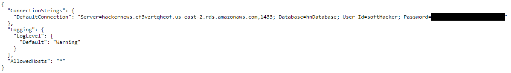
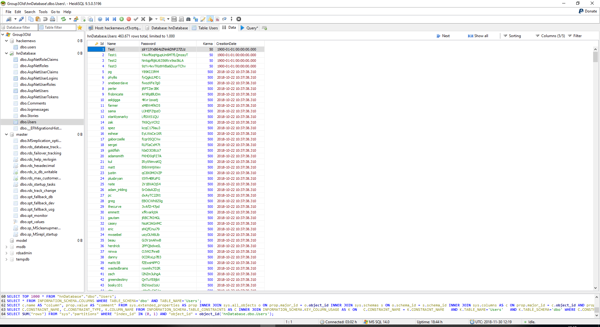

# Security

| Asset | Risk | Likelihood |
| --- | --- | --- |
| SQL-Database | Literally nothing | Rare |
| Droplet | Very low | Rare |

- Nothing worth stealing in the database; all posts are public; helge hashed passwords beforehand
- Prepared statements
- Database only accepts logins from localhost, need to compromise droplet to hack
- Escape html in posts
- SSH keys needed
- Two-factor authentication on Digitalocean
- Stateless
- No stack traces exposed to frontend

## Vulnerabilities

- Target this project: https://github.com/stanleyh007/Project_HNClone
- Checked with LGTM [results](https://raw.githubusercontent.com/KLMM-LSD/LSD-Experimental/lorem/scan.PNG)
- Attempt at social engineering


### Database connection string
In the file Project_HNClone/HNCloneApi/appsettings.json, a Database connection string is exposed.



Judging from the port number, and the fact that the .NET framework's System.Data.SqlClient is used to access the database, we determined that Group3 is probably running an instance of Microsoft SQL Server.
Our first attempts to access the database from home failed - seemingly because there was no database running at the given hostname - so we initially assumed that the server either did not accept external connections, and might be running on the same machine as their web servers, as is the case with our setup. 

This made the decision to use a public-facing hostname in the connection string look rather strange, and suspecting a whitelist restricting access to certain IPs, we tried connecting from the Wi-Fi in our classroom. This gained us access to Group3's database:




## OWTF
No matter what I tried OWTF wouldn't work for me, when I tried the command ``` docker-compose up ``` on the docker-compose file it went through all 25 steps out of 37 but stopped there because the module yaml couldn't be found. pyyaml and other yaml libraries were installed and I tried to even downgrade libraries and dependencies but it never got imported.
I event tried to install it manually both on the virtual environment and on the host but still didn't work.
