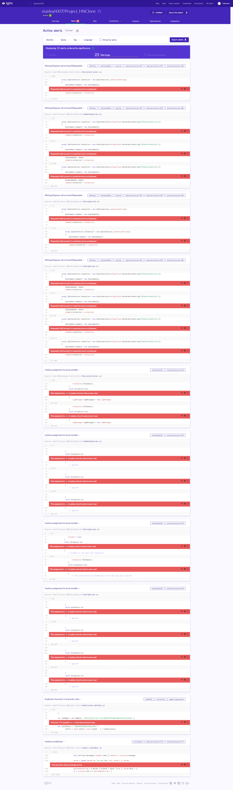

# Security

| Asset | Risk | Likelihood |
| --- | --- | --- |
| SQL-Databse | Literally nothing | Rare |
| Droplet | Very Low | Rare |

- Nothing worth stealing in the database; all posts are public; helge hashed asspwrods beforehand
- Prepared statements
- Database only accepts logins from localhost, need 2 copromise droplet 2 hack
- Escape html in posts
- ssh keys needed
- 2FA on Digitalocean
- Stateless
- No stack traces exposed to frontend

## Vulnberaribitlies

Our asignment was to ATTACK this project: https://github.com/stanleyh007/Project_HNClone

<<<<<<< HEAD
we checked with LGTM [results](scan.PNG)
=======
We checked with https://lgtm.com/

Though these are not security related
>>>>>>> 9757958f341e9b55b737f8a5d915c7ef3c395637

We also tried social engineerging, no respone yet

