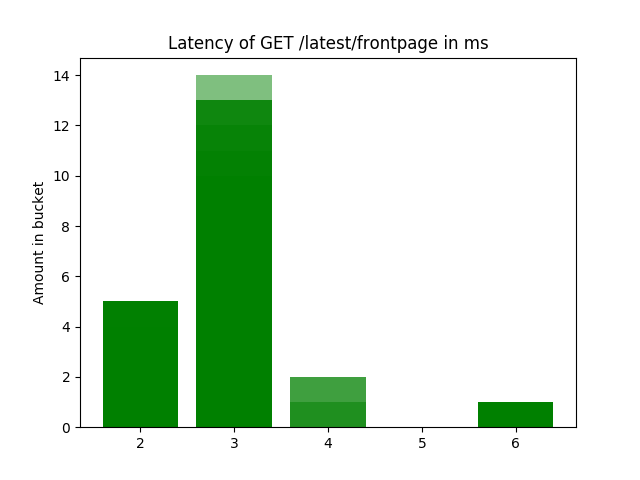

# Miscellaneous files

| File | Purpose |
| --- | --- |
| find_gaps.py | Check for missing numbers in a sequence from stdin, starting from 1 |
| poll.py | Check the response time and generate a histogram every 30 seconds |

```
$ mysql -N -uroot -proot lsd < postids.sql | python find_gaps.py
```



